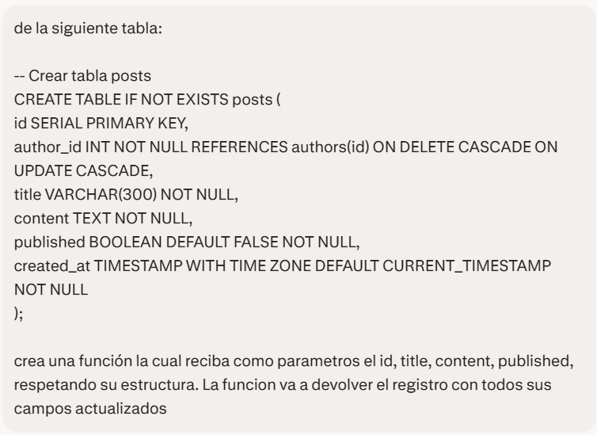
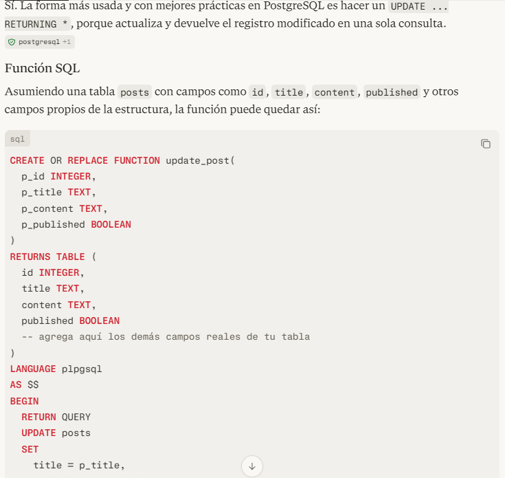
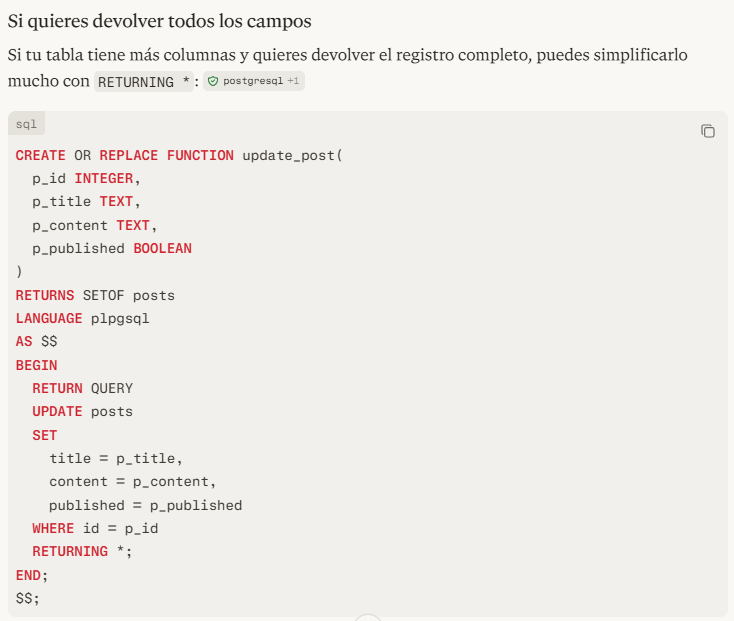
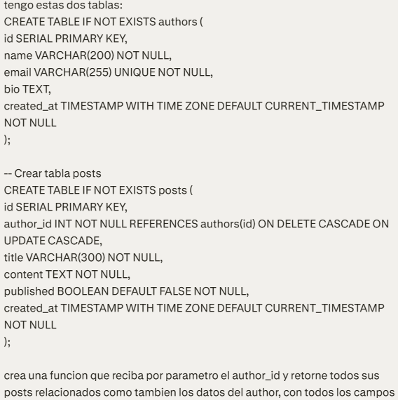
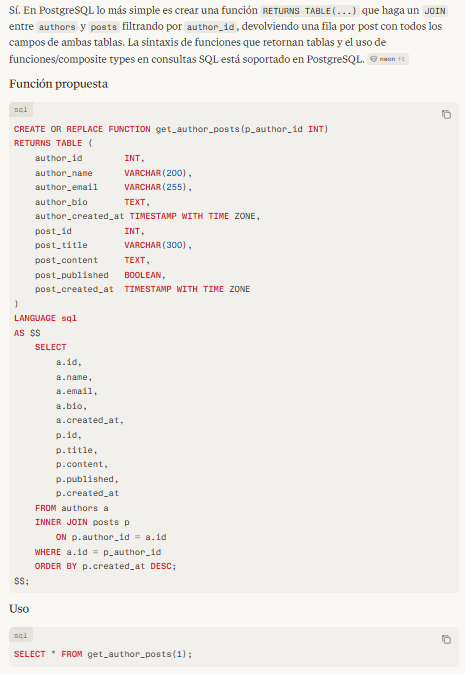
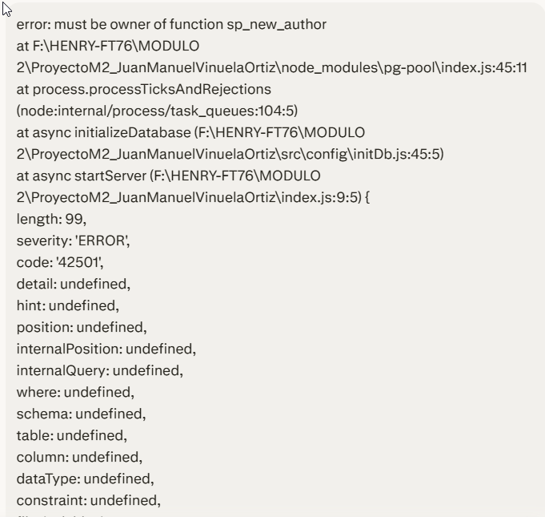
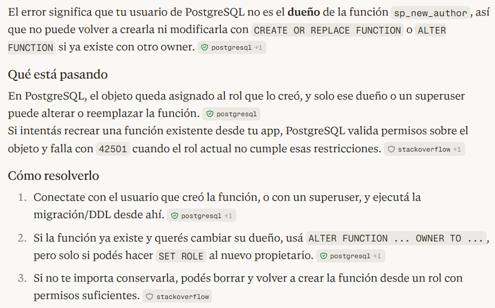

## 🤖 Documentación asistida por IA

---

Durante el desarrollo se utilizaron distintos prompts para pedir ayuda a la IA en temas de base de datos, errores de inicialización y documentación de la API.

---

### 🗃️ 1. Consultas sobre Base de Datos

**Objetivos principales:**

- Diseñar una función `UPDATE` en PostgreSQL para actualizar registros de manera segura.  
- Crear funciones que devuelvan información combinada de varias tablas (JOIN entre autores y posts).

#### 🔁 Función UPDATE en PostgreSQL

Prompt utilizado:



Respuestas de la IA:

- Primera propuesta:

  

- Propuesta alternativa (ajustada tras analizar el resultado):

  

> Se evaluaron ambas opciones y se refinó la lógica de actualización para que se adaptara mejor a la estructura real de la tabla y a las reglas de negocio del proyecto.

#### 🔗 Función con JOIN entre autores y posts

Prompt para combinar datos de dos tablas distintas:



Propuesta de la IA:



> A partir de esta función se obtuvo una forma práctica de devolver, en una sola llamada, información del autor junto con sus posts asociados.

---

### 🐘 2. Errores al ejecutar `seed.sql` al iniciar el servidor

Durante la inicialización de la base se presentaron errores relacionados con permisos y ejecución de scripts.

Prompt sobre el error:



Respuesta de la IA:



> Tras interpretar el mensaje de error y analizar las alternativas sugeridas, se optó por ajustar el **owner** del stored procedure (SP) y de las funciones afectadas, lo que permitió ejecutar el seed sin conflictos de permisos.

---

### 📚 3. Swagger UI / OpenAPI

La IA también se utilizó para apoyar la documentación de la API:

- Generación de especificaciones **OpenAPI 3.0**.
- Declaración de **schemas**, **tags**, **responses** y ejemplos de entrada/salida.
- Integración con `swagger-ui-express` para exponer la ruta:

```text
/api-docs
```

> Gracias a esto, la API cuenta con una interfaz de documentación interactiva que facilita el testeo y la exploración de endpoints desde el navegador.